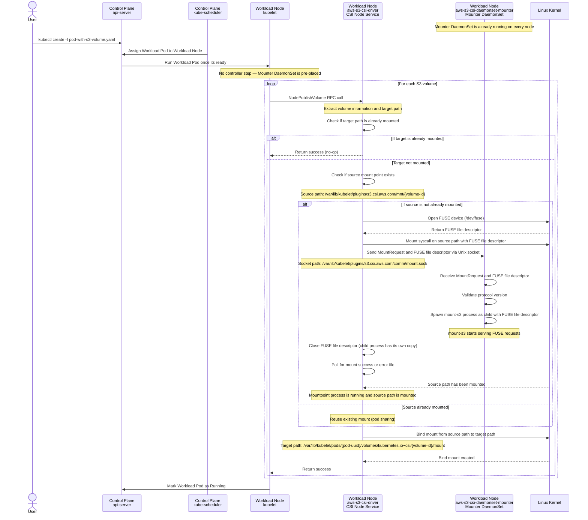
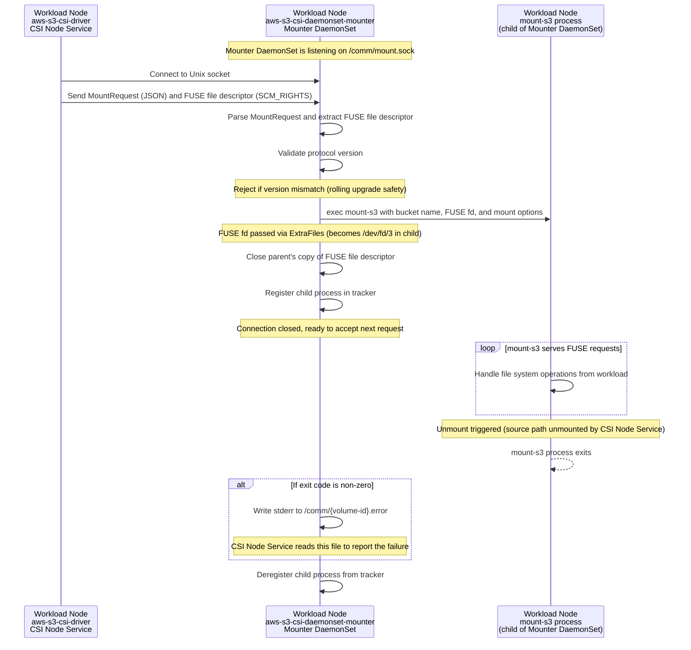

# Architecture of Mountpoint for Amazon S3 CSI Driver — Daemonset Mode

The Mountpoint for Amazon S3 CSI Driver supports an alternative deployment mode called **daemonset mode**. In this mode, Mountpoint processes run inside a long-lived DaemonSet pod on each node, rather than in individual Mountpoint Pods created dynamically by a controller. This eliminates scheduling failures that can occur in the default [pod mode](./ARCHITECTURE.md) when nodes don't have capacity for dynamically created Mountpoint Pods.

In daemonset mode, the CSI Driver consists of two components deployed to your cluster.

## The Node Component (`aws-s3-csi-driver`)

This component is the same binary as in pod mode, deployed as a DaemonSet on each node. It implements [CSI Node Service RPC](https://github.com/container-storage-interface/spec/blob/master/spec.md#node-service-rpc) and registers itself with the kubelet running on that node. When running in daemonset mode (configured via `DRIVER_MODE=daemonset`), it uses a different internal code path that communicates with the Mounter DaemonSet instead of Mountpoint Pods.

This component implements two important RPCs from the CSI:

* `NodePublishVolume` – Called by kubelet whenever there is a Pod running on that node that uses a volume provided by the CSI Driver. In daemonset mode, this method opens a FUSE device, performs a kernel mount, and sends the FUSE file descriptor along with mount options to the Mounter DaemonSet via a shared Unix socket. It then waits for the Mountpoint process to start serving, and creates a bind mount from the source path to the workload's target path. Unlike pod mode, there is no waiting for a controller to create a Mountpoint Pod — the Mounter DaemonSet is already running.

* `NodeUnpublishVolume` – Called by kubelet whenever the Pod using the volume is descheduled. This method unmounts the bind mount at the target path and unmounts the FUSE mount at the source path, which causes the corresponding Mountpoint process in the Mounter DaemonSet to exit.

The key code paths are:
- [`pkg/driver/node/node.go`](/pkg/driver/node/node.go) — CSI RPC entry points (shared with pod mode, unchanged)
- [`pkg/driver/node/mounter/daemonset_mounter.go`](/pkg/driver/node/mounter/daemonset_mounter.go) — `DaemonsetNodeMounter` implementing the `Mounter` interface
- [`pkg/driver/driver.go`](/pkg/driver/driver.go) — mode detection and mounter selection

This is what happens when a user creates a workload using a volume backed by the CSI Driver in daemonset mode:



## The Mounter Component (`aws-s3-csi-daemonset-mounter`)

This component is deployed as a DaemonSet on each node. It runs as a long-lived daemon that listens on a Unix socket for mount requests from the Node Component. For each request, it spawns a Mountpoint (`mount-s3`) process as a child and manages its lifecycle. Unlike pod mode where each Mountpoint process runs in its own Pod, in daemonset mode all Mountpoint processes on a node run as children of this single DaemonSet pod.

This component runs without any privilege and as a non-root user (uid 1000). It does not need access to `/dev/fuse` — the Node Component opens the FUSE device and passes the file descriptor to this component via [SCM_RIGHTS](https://man7.org/linux/man-pages/man7/unix.7.html) over the Unix socket.

The key code paths are:
- [`cmd/aws-s3-csi-daemonset-mounter/main.go`](/cmd/aws-s3-csi-daemonset-mounter/main.go) — binary entry point, signal handling
- [`pkg/daemonsetmounter/mounter.go`](/pkg/daemonsetmounter/mounter.go) — `DaemonsetMounter` accept loop and connection handling
- [`pkg/daemonsetmounter/request.go`](/pkg/daemonsetmounter/request.go) — `MountRequest` protocol definition and receive logic
- [`pkg/daemonsetmounter/children.go`](/pkg/daemonsetmounter/children.go) — child process tracking
- [`pkg/daemonsetmounter/errors.go`](/pkg/daemonsetmounter/errors.go) — error file management

This is what happens inside the Mounter DaemonSet when it receives a mount request:



## How the Two Components Communicate

The Node Component and the Mounter DaemonSet communicate through a shared directory on the host filesystem, mounted into both containers via a [hostPath](https://kubernetes.io/docs/concepts/storage/volumes/#hostpath) volume at `/var/lib/kubelet/plugins/s3.csi.aws.com/comm/`.

This directory contains:
- `mount.sock` — a Unix domain socket created by the Mounter DaemonSet. The Node Component connects to this socket to send mount requests.
- `{volume-id}.error` — error files written by the Mounter DaemonSet when a mount-s3 process fails. The Node Component polls for these files to detect mount failures.

The mount request protocol uses [SCM_RIGHTS](https://man7.org/linux/man-pages/man7/unix.7.html) to pass the FUSE file descriptor from the Node Component to the Mounter DaemonSet. This is a Linux mechanism for transferring open file descriptors between processes over Unix domain sockets. The JSON payload of the request contains the bucket name, mount-s3 arguments, environment variables (including AWS credentials), and a protocol version number for rolling upgrade safety.

The protocol is defined in [`pkg/daemonsetmounter/request.go`](/pkg/daemonsetmounter/request.go) (receive side) and [`pkg/daemonsetmounter/send.go`](/pkg/daemonsetmounter/send.go) (send side). It is intentionally independent of the pod mode protocol ([`pkg/mountpoint/mountoptions/mount_options.go`](/pkg/mountpoint/mountoptions/mount_options.go)) so the two modes can evolve separately.

## Comparison with Pod Mode

| Aspect | Pod Mode ([ARCHITECTURE.md](./ARCHITECTURE.md)) | Daemonset Mode (this document) |
|---|---|---|
| Components | Node + Controller + Mountpoint Pods | Node + Mounter DaemonSet |
| Mountpoint process lifecycle | One Pod per mount, created dynamically | One DaemonSet pod per node, manages all mounts as children |
| Scheduling | Mountpoint Pod created after workload scheduling — can fail if node is full | Mounter DaemonSet pre-placed on every node — no scheduling failures |
| Controller | Required (creates Mountpoint Pods, manages S3PA CRDs) | Not deployed |
| S3PA CRD | Required (tracks workload-to-Mountpoint-Pod assignments) | Not used |
| Pod sharing | Supported via S3PA CRD (controller decides) | Planned for Phase 2 (refcount-based in Node Component) |
| Upgrade | Non-disruptive (new Mountpoint Pods use new version) | Disruptive (requires node drain — restarting Mounter DaemonSet kills all mounts) |
| Blast radius | One Mountpoint Pod crash affects one mount | Mounter DaemonSet crash affects all mounts on the node |
| Security | Mountpoint Pod runs unprivileged, non-root | Mounter DaemonSet runs unprivileged, non-root (same) |

## Enabling Daemonset Mode

Daemonset mode is enabled via the Helm chart:

```bash
helm upgrade --install aws-mountpoint-s3-csi-driver \
    --namespace kube-system \
    --set mode=daemonset \
    aws-mountpoint-s3-csi-driver/aws-mountpoint-s3-csi-driver
```

When `mode=daemonset`:
- The Mounter DaemonSet (`s3-csi-mounter`) is deployed alongside the Node DaemonSet (`s3-csi-node`)
- The Node DaemonSet receives `DRIVER_MODE=daemonset` and uses `DaemonsetNodeMounter` instead of `PodMounter`
- The Controller Deployment, S3PA CRD, and `mount-s3` namespace are still deployed but unused by the Node Component

When `mode=pod` (default):
- The driver operates exactly as described in [ARCHITECTURE.md](./ARCHITECTURE.md)
- The Mounter DaemonSet is not deployed
- No behavior change from the default installation
